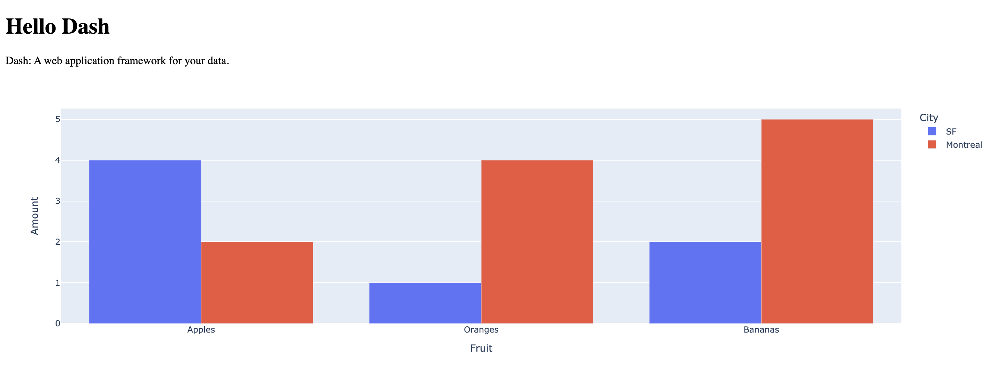

# 🛠️ **dash-tools** - _Easily Create and Deploy your Plotly Dash Apps from CLI (V0.6)_

Create a templated multi-page [Plotly Dash](https://plotly.com/dash/) app with CLI in less than 7 seconds.

Deploy your app to [Heroku](https://heroku.com/) in under a minute!


## **About**

[**dash-tools**](https://github.com/andrew-hossack/dash-tools) is an open-source toolchain for [Plotly Dash Framework](https://dash.plotly.com/introduction). With a user-friendly command line interface, creating Dash applications has never been quicker.

Includes user and developer-friendly app templates where generating a new app only takes seconds. In fact, it will take longer to install this tool than it will to use it!

Want to deploy your app to the web? We've got you covered. With [Heroku](https://heroku.com/) support, deploying your project will take under a minute.

## **Installation**

Ready to use **dash-tools**? Installation is easy with pip:

```bash
pip install dash-tools
```

Find [dash-tools on PyPi](https://pypi.org/project/dash-tools/)

## **Usage Examples**

Below are common usage examples. See [_Commands_](#commands) section for more details.

### **Creating New Projects**

Creating a new Dash project is very simple. The following command will create a new directory called "MyDashApp" from where the command is invoked:

```bash
# Create the app "MyDashApp"
dash-tools --init MyDashApp

# Check out your new project!
cd MyDashApp/
```

### **Using Templates**

Templates offer different project styles and include different boilerplate code samples. Creating a new app with templates is easy, just use the optional template argument after --init. If you do not specify a template, '_default_' will be used. See the [_Templates_](#templates) section below for more details.

```bash
# Create a new Dash app called "MyWonderfulApp" using 'minimal' template
dash-tools --init MyWonderfulApp minimal
```

To list out available templates, use the `--templates` command:

```bash
# Display available templates
dash-tools --templates

>>> dash-tools: templates: List of available templates:
>>>   default
>>>   minimal
>>>   heroku
```

### **Deploying with Heroku**

To create a project and deploy to [Heroku](https://www.heroku.com/), it is quite simple. You can even create a project using the '_heroku_' template which includes `Procfile`, `requirements.txt`, and `runtime.txt`.

Using the `--deploy-heroku` command in the project root directory will look for the above files. The directory needs to be a git repository. The [Heroku CLI](https://devcenter.heroku.com/categories/command-line) must also be installed.

The command takes one argument for the project name, which may only contain lowercase, alphanumeric characters and dashes. It must be unique and not already on Heroku. The process will create a new git remote called 'heroku' with the heroku remote url to push/deploy all project code, and will return a URL of your deployed project with the project name you chose, such as [https://your-unique-app-name.herokuapp.com/](#deploying-with-heroku).

```bash
# Create a new app "MyGreatHerokuApp" with the 'heroku' template
dash-tools --init MyGreatHerokuApp heroku

# Change current directory to your new project root directory
cd MyGreatHerokuApp/

# Using the following command will start the deploy process
# Follow the instructions in the console to deploy your app
dash-tools --deploy-heroku your-unique-app-name
```

And that's really it! A new heroku app and git remote will be created, and all project code will be deployed.

## **Templates**

Listed below are available project templates. Please see the above [examples](#using-templates) on how to use templates.

- **default** - the default multi-page template. Includes examples of ClientsideCallbacks, multi-page routing, external stylesheets, header, footer, and 404 page.
  
- **minimal** - for the minimalists. Not much here but the bare bones.
  
- **heroku** - Build for deployment with Heroku. Includes necessary deploy files. Built on the minimal template. Includes: `Procfile`, `requirements.txt`, `runtime.txt`
  

If you would like to develop templates, please read the [_Creating Templates_](#creating-templates) section below.

## **Commands**

### **Project Commands**

- **`--deploy-heroku` Args: REQUIRED (`unique heroku project name`) :** Deploys the project to Heroku using the [Heroku CLI](https://devcenter.heroku.com/categories/command-line) (Must Install Seperately) and [Git](https://git-scm.com/downloads). Invoke from the project root directory.
- **`--init, -i` Args: REQUIRED (`project name`) OPTIONAL (`template`) :** Creates a Plotly Dash app with the given name in the current working directory. Optional args specified can be used for templates.
- **`--templates, -t` :** List available templates.

### Other

- **`--help, -h`:** Display CLI helpful hints
- **`--version`:** Display current version.

## **Development**

### **Creating Templates**

1. Templates are found here: `dash_tools/templating/templates/<Template Name>`. When a user uses CLI to choose a template with the name `<Template Name>` the template will be copied to their system.
2. Adding a new template to the templates directory requires adding the new template to the Enum list in `templating.Templates` Enum. Template name must match Enum value, eg.

   ```python
   class Templates(Enum):
      DEFAULT = 'default'
      MINIMAL = 'minimal'
      NEWTEMPLATE = 'newtemplate'
   ```

3. Any file names or files containing the strings `{appName}` or `{createTime}` will be formatted with the given app name and creation time. Eg. _README.md.template_: `# Created on {createTime}` will copy to the user's filesystem as _README.md_: `# Created on 2022-03-30 22:06:07`
4. All template files must end in `.template`

## **License**

MIT License. See LICENSE.txt file.
