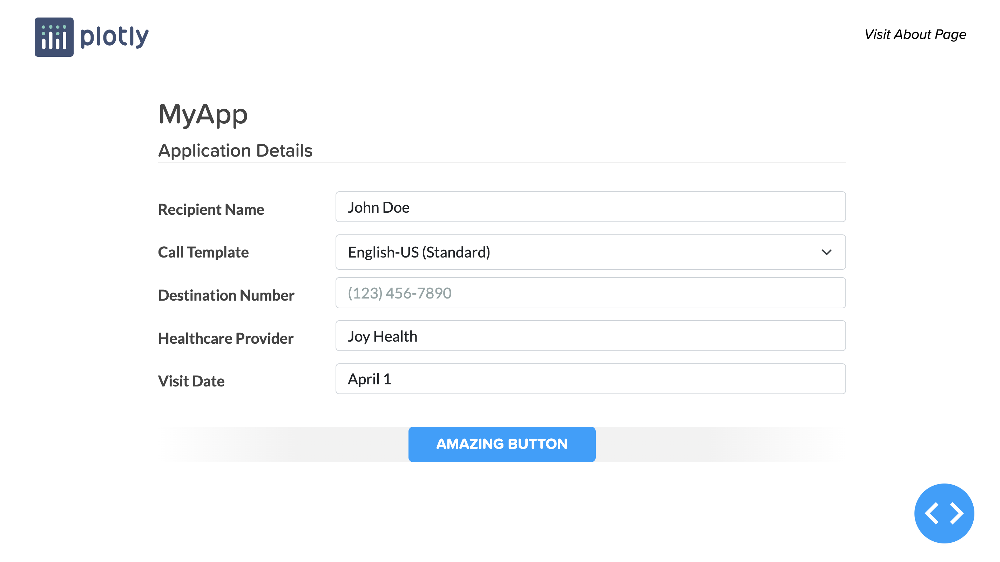
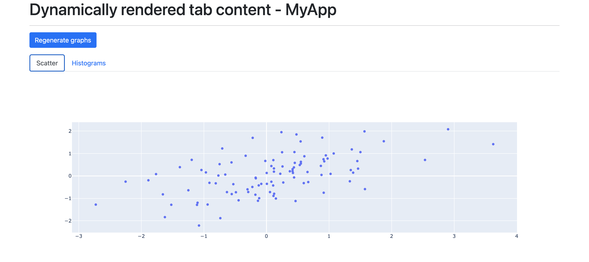

<div align="center">
<h1>
<b>🛠️ dash-tools 🛠️</b><br>
<i>Plotly Dash Command Line Tools</i>
</h1>

[](https://github.com/andrew-hossack/dash-tools) | [](https://pypi.org/project/dash-tools/) |  |  |  | 


<h3>
<b><i>Create and Deploy Plotly Dash apps to Heroku in less than a minute!</i></b>
</h3>

</div>

## **About**

[**dash-tools**](https://github.com/andrew-hossack/dash-tools) is an open-source toolchain for [Plotly Dash Framework](https://dash.plotly.com/introduction). With a user-friendly command line interface, creating Dash applications has never been quicker.

Includes user and developer-friendly app templates where generating a new app only takes seconds. In fact, it will take longer to install this tool than it will to use it!

Want to deploy your app to the web? We've got you covered. With [Heroku](https://heroku.com/) support, deploying your project will take under a minute.

## **Installation**

Ready to use **dash-tools**? Installation is easy with pip:

```bash
pip install dash-tools
```

Requires:

- **Heroku CLI** which can be downloaded [Here](https://devcenter.heroku.com/articles/heroku-cli#install-the-heroku-cli)
- **Git CLI** which can be downloaded [Here](https://git-scm.com/downloads)

[Find dash-tools on PyPi](https://pypi.org/project/dash-tools/)

## **Usage Examples**

Below are common usage examples. For a more in-depth tutorial on writing apps for Plotly Dash, see the [Plotly Dash Documentation](https://dash.plotly.com/layout). For information about dash-tools commands, read the [_Commands_](#commands) section.

### **Creating A New Project**

> _For a more in-depth tutorial on using dash-tools, check out the [Create and Upload Your App](/docs/Configuring-Your-App.md) document!_

Creating a new Dash project is very simple. The following command will create a new directory called "MyDashApp":

```bash
dash-tools --init MyDashApp
```

Optionally, templates can be used. Check out [Templates](#templates) for more details.

You can see what files are included with your new app:

```bash
cd MyDashApp
```

You can make changes to your app in the `src/app.py` file! See [Plotly Dash Layout Docs](https://dash.plotly.com/layout) for more information, or check out the dash-tools docs on [Configuring Your Dash App](/docs/Configuring-Your-App.md).

When you are happy with your changes, run your dash app locally with the following command. You will be able to view your app at http://127.0.0.1:8050/ in your browser:

```bash
python src/app.py
```

#### **Loading CSV Files**

A common use for Dash is to display CSV data. To see an example, use the following command to create a "MyCSVApp" app with the 'csv' template:

```bash
dash-tools --init MyCSVApp csv
```

See the [Templates](#templates) section for more details on using templates.

### **Deploying To Heroku**

Deploying your project online to [Heroku](https://www.heroku.com/) is simple. The CLI handles both creating and deploying a new app, as well as updating an existing app.

#### **Using dash-tools to Create An App**

To create an app, run the following command from your project's root directory; e.g. _/MyDashApp_ from the example above. Next, follow the simple on-screen directions and deployment will be handled for you:

```bash
dash-tools --deploy-heroku
```

Optionally, you can specify a heroku app name as an argument. If one is not provided, you will be prompted to enter one or generate one automatically.

_Note: "some-unique-heroku-app-name" in the example below is a name that you should change!_

```bash
dash-tools --deploy-heroku some-unique-heroku-app-name
```

And that's really it! You will be prompted to log into your heroku account, a git remote 'heroku' will be created and changes will be pushed and deployed automatically.

#### **Uploading Your Existing (non dash-tools) Dash App**

Uploading an existing application without using a dash-tools templated app is easy. You need to make sure of the following:

- Your project contains `src/app.py` application file
- Your `src/app.py` file contains the `server = app.server` declaration for heroku

Since the deploy command will create your Procfile, runtime.txt and requirements.txt files for you, there is no need to worry about creating them yourself.

To deploy, the next steps will be the same [as above](#using-dash-tools-to-create-an-app).

#### **Pushing Changes to an Existing Heroku Remote**

To push changes to an existing heroku app after it is deployed, you can use the same command as before. Since a 'heroku' git remote already exists, by choosing the on-screen option to "Update Existing App", all changes will be pushed and your app will be re-deployed:

```bash
dash-tools --deploy-heroku
```

If you would rather add specific files, make a commit and push to the 'heroku' remote manually:

```bash
git add SomeFileYouModified.txt
git commit -m "Your Commit Message"
git push heroku
```

## **Templates**

Templates contain boilerplate code for Dash projects, making it much easier to start with useful baseline apps.

### **Using Templates**

Use the optional template argument with the `--init` command.

The following example will create a new app "MyWonderfulApp" (you can name your app anything) using the 'tabs' template (or any other template listed below):

```bash
dash-tools --init MyWonderfulApp tabs
```

To list out available templates, use the `--templates` or `-t` command:

```bash
dash-tools --templates
```

### **Available Templates**

_Click the dropdowns below to see screenshots!_

<details><summary>Template: 'advanced'</summary>

_To use this template, type: `dash-tools --init MyFuturisticApp advanced`_

Advanced multi-page template. Includes examples of ClientsideCallbacks, multi-page routing, external stylesheets, header, footer, and 404 page.


</details>

<details><summary>Template: 'csv'</summary>

_To use this template, type: `dash-tools --init MyCSVLoaderApp csv`_

Example of CSV file loading. Includes the default CSV load example from Plotly.


</details>

<details><summary>Template: 'default'</summary>

_To use this template, type: `dash-tools --init MyAmazingApp default`_

Basic Dash template. See [Dash Docs](https://dash.plotly.com/layout)


</details>

<details><summary>Template: 'iris'</summary>

_To use this template, type: `dash-tools --init MyFantasticApp iris`_

Iris theme. See [Faculty.ai Example](https://dash-bootstrap-components.opensource.faculty.ai/examples/iris/)


</details>

<details><summary>Template: 'mantine'</summary>

_To use this template, type: `dash-tools --init MyGreatApp mantine`_

Basic mantine template. See [Dash Mantine](https://www.dash-mantine-components.com/)


</details>

<details><summary>Template: 'multipage'</summary>

_To use this template, type: `dash-tools --init MyPristineApp multipage`_

New multipage theme. See [Multipage Plugin](https://github.com/plotly/dash-labs/blob/main/docs/08-MultiPageDashApp.md)


</details>

<details><summary>Template: 'sidebar'</summary>

_To use this template, type: `dash-tools --init MySnazzyApp sidebar`_

Sidebar theme. See [Faculty.ai Example](https://dash-bootstrap-components.opensource.faculty.ai/examples/simple-sidebar/)


</details>

<details><summary>Template: 'tabs'</summary>

_To use this template, type: `dash-tools --init MyBeautifulApp tabs`_

Tabs theme with dynamically generated content. See [Faculty.ai Example](https://dash-bootstrap-components.opensource.faculty.ai/examples/graphs-in-tabs/)


</details>

## **Commands**

### **Project Commands**

- **`--deploy-heroku` Args: OPTIONAL (`unique heroku project name`) :** Deploys the project to Heroku using the [Heroku CLI](https://devcenter.heroku.com/categories/command-line) (Must Install Seperately) and [Git](https://git-scm.com/downloads). Invoke from the project root directory.
- **`--init, -i` Args: REQUIRED (`project name`) OPTIONAL (`template`) :** Creates a Plotly Dash app with the given name in the current working directory. Optional args specified can be used for templates.
- **`--templates, -t` :** List available templates.

### **Other**

- **`--help, -h`:** Display CLI helpful hints
- **`--version`:** Display current version.

## **Troubleshooting Common Issues**

Running into issues? Outlined below are common errors and solutions. If you do not find an answer below, please [Submit an Issue Ticket](https://github.com/andrew-hossack/dash-tools/issues).

### **Common `--init` Issues**

<details><summary>No write permission</summary>

_Problem:_ You receive a 'write permission' error while trying to init a new app

_Solution:_ Please check your write permissions for the current directory. Try the init command from a different directory.

</details>

### **Common `--deploy-heroku` Issues**

<details><summary>Error when creating requirements.txt file</summary>

_Problem:_ You encounter an error when generating a requirements.txt file

_Solution:_ Verify that you are running the `dash-tools --deploy-heroku` command from a valid plotly dash app directory. E.g. there is a `src/app.py` file.

</details>

## **Development**

See the [Developer Guide](CONTRIBUTING.md) for more details.

## **License**

MIT License. See LICENSE.txt file.
