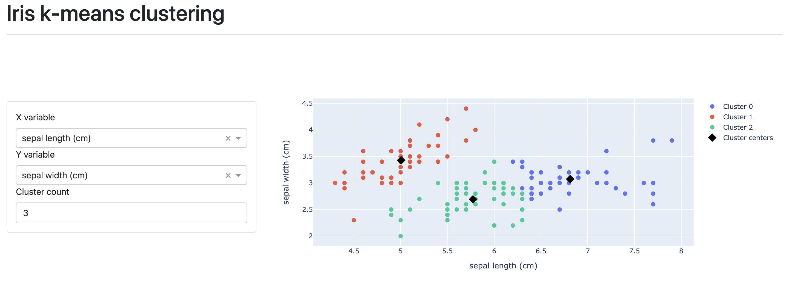

<div align="center">


<hr>
<h3>
<b><i>Create, Run and Deploy Templated Plotly Dash Apps from Terminal</i></b>
</h3>


[](https://github.com/andrew-hossack/dash-tools) | [](https://pypi.org/project/dash-tools/) | [](https://pepy.tech/project/dash-tools) |  |  | 


</div>

## **About**

[**dashtools**](https://github.com/andrew-hossack/dash-tools) is an open-source toolchain for [Plotly Dash Framework](https://dash.plotly.com/introduction). With a user-friendly command line interface, creating Dash applications and deploying them to the web has never been quicker.

Includes user and developer-friendly app templates where generating a new app only takes seconds. In fact, it will take longer to install this tool than it will to use it!

Want to deploy your app to the web? We've got you covered. With [Heroku](https://heroku.com/) support, deploying your project will take under a minute.

## **Installation**

Ready to use **dashtools**? Installation is easy with pip:

```bash
pip install dash-tools
```

[Find dash-tools on PyPi](https://pypi.org/project/dash-tools/)

#### Requires:

- **Heroku CLI** which can be downloaded [Here](https://devcenter.heroku.com/articles/heroku-cli#install-the-heroku-cli)
- **Git CLI** which can be downloaded [Here](https://git-scm.com/downloads)
- **OS** - Linux, MacOS, Windows currently supported

## **Usage Examples**

### A. Create an App

1. Create a Dash project in a new directory called "MyDashApp" (using your terminal or command prompt):
   <details>
     <summary>Note</summary>
     "MyDashApp" can be changed to any name. However, for the purpose of this tutorial, we recommend keeping it as "MyDashApp".
   </details>

   ```bash
   dashtools init MyDashApp
   ```

2. Open the default `app.py` file that comes with this project:
   <details>
     <summary>Windows</summary>

   ```bash
    .\MyDashApp\src\app.py
   ```

   </details>
   <details>
     <summary>Linux and Mac OS</summary>

   ```bash
    ./MyDashApp/src/app.py
   ```

   </details>

3. Replace the code in `app.py` with your own app code. Make sure to keep the `server = app.server` right after app instantiation:


4. Make sure you are in your project's root directory:

   ```bash
   cd MyCSVApp
   ```

5. Run your app to ensure it works:

   ```bash
   dashtools run
   ```

#### Deploy App to Web with Heroku

6. Deploy to Heroku:

   ```bash
   dashtools heroku --deploy
   ```


### B. Create an App with Local CSV sheet

A common use for Dash is to display CSV data that is located inside the project folder. For this, you can use the CSV Dash-tools template to create a project with CSV data.

1. Using App template with CSV

   ```bash
   dashtools init MyCSVApp csv
   ```

2. Replace the code in `app.py` with your own app's code, like shown in **example A** above. Make sure to keep code lines 13, 26, and 27.

   - 13: `server = app.server`
   - 26: `PATH = pathlib.Path(__file__).parent`
   - 27: `DATA_PATH = PATH.joinpath("data").resolve()`

3. Replace the default CSV file in the `data` folder with your own CSV file

4. Make sure you are in your project's root directory:

   ```bash
   cd MyCSVApp
   ```

5. Run your app to ensure it works:

   ```bash
   dashtools run
   ```

#### Deploy App to Web with Heroku

6. Deploy to Heroku:

   ```bash
   dashtools heroku --deploy
   ```

---

## **Templates**

Templates contain boilerplate code for Dash projects, making it much easier to start with useful baseline apps.

### **Using Templates**

Use the optional template argument with the `--init` command.

The following example will create a new app "MyWonderfulApp" (you can name your app anything) using the 'tabs' template (or any other template listed below):

```bash
dash-tools --init MyWonderfulApp tabs
```

To list out available templates, use the `--templates` or `-t` command:

```bash
dash-tools --templates
```

### **Available Templates**

_Click the dropdowns below to see screenshots!_

<details><summary>Template: 'advanced'</summary>

_To use this template, type: `dash-tools --init MyFuturisticApp advanced`_

Advanced multi-page template. Includes examples of ClientsideCallbacks, multi-page routing, external stylesheets, header, footer, and 404 page.


</details>

<details><summary>Template: 'csv'</summary>

_To use this template, type: `dash-tools --init MyCSVLoaderApp csv`_

Example of CSV file loading. Includes the default CSV load example from Plotly.


</details>

<details><summary>Template: 'default'</summary>

_To use this template, type: `dash-tools --init MyAmazingApp default`_

Basic Dash template. See [Dash Docs](https://dash.plotly.com/layout)


</details>

<details><summary>Template: 'iris'</summary>

_To use this template, type: `dash-tools --init MyFantasticApp iris`_

Iris theme. See [Faculty.ai Example](https://dash-bootstrap-components.opensource.faculty.ai/examples/iris/)


</details>

<details><summary>Template: 'mantine'</summary>

_To use this template, type: `dash-tools --init MyGreatApp mantine`_

Basic mantine template. See [Dash Mantine](https://www.dash-mantine-components.com/)


</details>

<details><summary>Template: 'multipage'</summary>

_To use this template, type: `dash-tools --init MyPristineApp multipage`_

New multipage theme. See [Multipage Plugin](https://github.com/plotly/dash-labs/blob/main/docs/08-MultiPageDashApp.md)


</details>

<details><summary>Template: 'sidebar'</summary>

_To use this template, type: `dash-tools --init MySnazzyApp sidebar`_

Sidebar theme. See [Faculty.ai Example](https://dash-bootstrap-components.opensource.faculty.ai/examples/simple-sidebar/)


</details>

<details><summary>Template: 'tabs'</summary>

_To use this template, type: `dash-tools --init MyBeautifulApp tabs`_

Tabs theme with dynamically generated content. See [Faculty.ai Example](https://dash-bootstrap-components.opensource.faculty.ai/examples/graphs-in-tabs/)


</details>

## **Commands**

### **Project Commands**

- **`--deploy-heroku` Args: OPTIONAL (`unique heroku project name`) :** Deploys the project to Heroku using the [Heroku CLI](https://devcenter.heroku.com/categories/command-line) (Must Install Seperately) and [Git](https://git-scm.com/downloads). Invoke from the project root directory.
- **`--init, -i` Args: REQUIRED (`project name`) OPTIONAL (`template`) :** Creates a Plotly Dash app with the given name in the current working directory. Optional args specified can be used for templates.
- **`--templates, -t` :** List available templates.

### **Other**

- **`--help, -h`:** Display CLI helpful hints
- **`--version`:** Display current version.

## **Troubleshooting Common Issues**

Running into issues? Outlined below are common errors and solutions. If you do not find an answer below, please [Submit an Issue Ticket](https://github.com/andrew-hossack/dash-tools/issues).

### **Common `--init` Issues**

<details><summary>No write permission</summary>

_Problem:_ You receive a 'write permission' error while trying to init a new app

_Solution:_ Please check your write permissions for the current directory. Try the init command from a different directory.

</details>

### **Common `--deploy-heroku` Issues**

<details><summary>Error when creating requirements.txt file</summary>

_Problem:_ You encounter an error when generating a requirements.txt file

_Solution:_ Verify that you are running the `dash-tools --deploy-heroku` command from a valid plotly dash app directory. E.g. there is a `src/app.py` file.

</details>

## **Development**

See the [Developer Guide](CONTRIBUTING.md) for more details.

## **License**

MIT License. See LICENSE.txt file.
